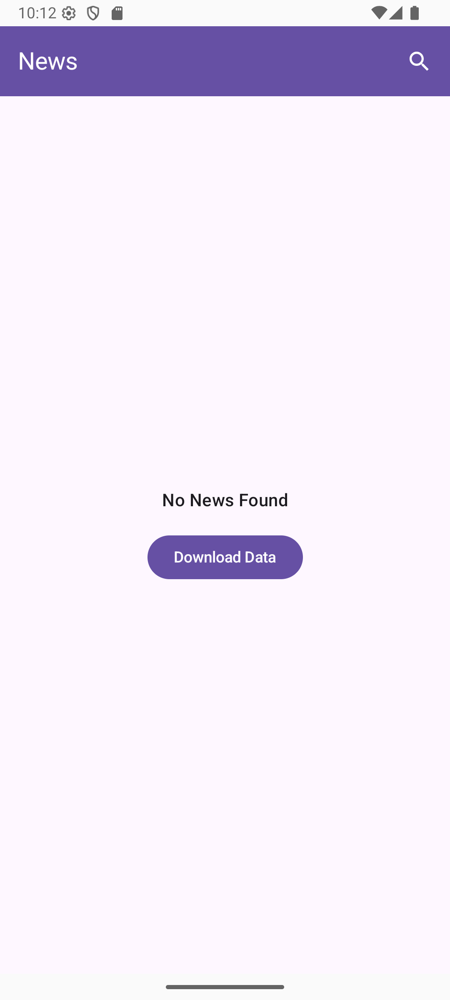
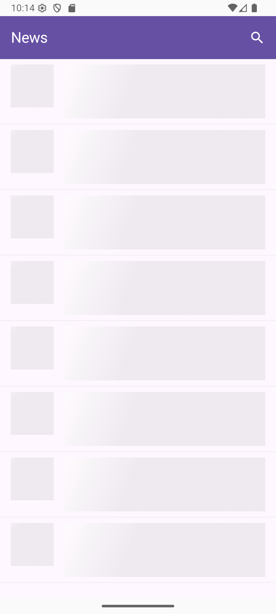

Simple MVVM
---
## Setup
1. Clone the Repository
   ```gradle
   git clone https://github.com/benidarma/SimpleMVVM.git
   ```
2. Setup local.properties
   Inside the root project folder, open or create a file named `local.properties` and add:
   ```gradle
   base.url.debug=https://newsapi.org/v2/
   base.url.release=https://newsapi.org/v2/
   api.key=YOUR_API_KEY
   ```
   *Replace YOUR_API_KEY with your actual API key from:*
   *https://newsapi.org/account*
---
## Features
- Jetpack Compose
- MVVM Architecture
- Hilt
- Retrofit & OkHttp
- Room
- Kotlin Coroutines & Flow
- Material 3
---
## Screenshots
| | | |
|:-------------------------:|:-------------------------:|:-------------------------:|
|  |  |  |
|  |  | |	
---
## Video
**Direct Link:**  
https://drive.google.com/file/d/1IzcXly5l53bkZUUbyWeEIAnRHVTMFOW2/view?usp=sharing